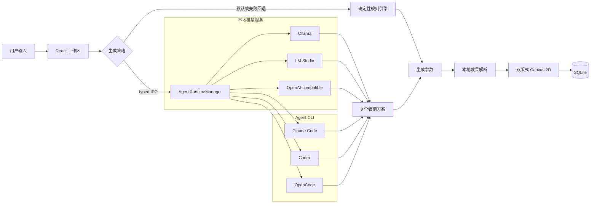

# EmojiPie 第一版技术方案

## 目标与技术栈

EmojiPie 使用 Electron 统一 Windows 与 macOS 桌面体验，React + TypeScript 实现界面，
Canvas 2D 生成双版式 PNG，Node.js SQLite 保存历史、收藏与偏好，electron-vite 负责开发和构建。
AI 能力采用统一的本机运行时管理器，既支持本地模型 HTTP 服务，也支持本机 Agent CLI；
渲染进程不直接访问模型或启动进程。

CLI 部分对齐本地 Multica `34d5445` 的 `server/pkg/agent` 与
`server/internal/daemon/config.go`：业务层依赖统一执行契约，provider 差异由 backend
隔离，发现阶段固定规范化可执行路径，单个运行时失败不影响其他运行时。

## 总体架构



图中模型与 CLI 只负责文本分析和方案规划；绘制、复制、导出、收藏与持久化仍由
EmojiPie 控制。预加载桥只暴露白名单 IPC，渲染进程启用上下文隔离并关闭 Node.js 集成。

## 统一运行时契约

共享配置为 `enabled + runtimeId + executablePath + endpoint + model`。`endpoint` 只用于
本地模型，`executablePath` 用于 Agent CLI 和可由应用启动的 Ollama。生成调用统一返回：

```ts
interface AgentRuntimeGenerationResult {
  analysis: TextAnalysis
  variants: Array<{ emotion: EmotionId; caption: string }> // 严格 9 个
  runtimeId:
    | 'ollama'
    | 'lmstudio'
    | 'openai-compatible'
    | 'claude'
    | 'codex'
    | 'opencode'
  runtimeName: string
  model: string
  durationMs: number
}
```

Canvas 参数生成器直接消费每个 runtime variant 的情绪与文案。响应会校验情绪枚举、
场景枚举、非空文案、文案长度和 9 项数量。本地模型首次
不合规时按相同 Schema 纠错重试一次，仍失败则由界面回退规则引擎。

## 效果预设与智能搭配

界面提供 `smart` 生成选择，以及 `classic`、`cute`、`deadpan`、`office`、`sarcastic`、
`spectator`、`chaos` 七种具体效果。每个选项使用同一固定参数经正式 Canvas 渲染器生成
缩略图，因此预览与最终图片不存在两套素材。

`smart` 只存在于生成输入层。`resolveEmojiStyle` 根据 `TextAnalysis.scene`、候选 emotion
和批次位置，在本地选择具体效果；九项运行时契约不增加字段。`EmojiRecord.style` 只保存
具体效果，旧记录无需迁移，再次创作时恢复该记录实际使用的效果。

候选区固定为 9 张，不再通过 `IntersectionObserver` 自动追加。“换一批”捕获上一批的
文案、模式、效果选择与渲染设置，重新执行完整生成流程；旧候选在成功前保持可用，失败
时不会清空，成功后整批替换。新旧批次均保存在 SQLite 历史记录中。

## 双版式渲染与数据兼容

渲染设置由 `EmojiRenderSettings` 表示，包含 `layout: 'compact' | 'poster'` 与
`embedCaption: boolean`。新用户默认使用 `compact + false`，设置经类型化 IPC 保存到
SQLite `preferences`；浏览器预览使用 `localStorage`。生成和换批均使用不可变设置快照，
再次创作历史记录时恢复该记录的设置。

- **小黄脸**：先在 `640x640` 透明画布绘制，再高质量缩放为 `256x256` PNG。无字模式下
  主体约占画布 85%；带字模式将主体缩至约 72%，底部最多绘制两行、14 个可见字符。
- **表情海报**：保持现有 `640x640` 构图与文字牌。无字模式移除全部画内文字，将主体
  放大约 18% 并垂直居中。
- 关闭图片内文字不改变运行时九项协议。caption 继续用于卡片标题、检索、复制和导出文件名。

`generations` 同步保存 `layout` 与 `embed_caption`。启动时通过幂等迁移为旧数据库补列，
数据库默认值固定为 `poster + true`，因此旧历史、收藏、复制和导出图片不会被重新渲染或改变。

## 本地模型运行时

### 发现与协议

1. Ollama 读取 `/api/tags`，生成调用 `/api/chat`，优先通过 `format: JSON Schema` 请求结构化
   输出；旧服务明确拒绝 Schema 时回退到 `format: "json"`，最终仍执行相同的九项校验。
2. LM Studio 与通用本地服务读取 `/v1/models`，生成调用 `/v1/chat/completions`。先使用严格
   `json_schema`；仅当服务明确返回 `400`、`404` 或 `422` 时回退到 `json_object`。
3. 模型目录缓存 60 秒，空目录不缓存。发现和生成超时分别为 2.5 秒与 60 秒，单次响应
   最大 2 MB，HTTP 重定向被禁止。
4. 服务地址规范化后只接受 `localhost`、`127.0.0.0/8` 或 `::1`；`localhost` 还会执行
   DNS 回环校验，避免运行时接口变成任意网络请求通道。

### Ollama 受控启动

Ollama 可执行文件依次从用户绝对路径、`EMOJI_PIE_OLLAMA_PATH`、`PATH` 和系统常见安装
目录发现。只有用户点击“启动 Ollama”后才执行 `ollama serve`，使用参数数组、
`shell: false` 和隐藏窗口。管理器只记录本次由 EmojiPie 创建的子进程，退出应用时只
清理该进程；已在系统中运行的 Ollama 不会被接管或终止。

## Agent CLI 运行时

### 发现与模型目录

1. 用户填写的绝对路径是硬覆盖；路径无效时直接报错，不静默回退。
2. 未覆盖时依次读取 `EMOJI_PIE_<RUNTIME>_PATH`、`PATH`，macOS/Linux 最后执行一次
   3 秒受限 login-shell 发现。
3. 命中路径后使用 `realpath` 固定规范化路径。Windows npm `.cmd` shim 会解析为
   `node.exe + package entry`，实际执行不经过 shell。
4. 版本探测相互隔离。模型目录缓存 60 秒，空结果不缓存；Claude 和旧版 Codex 使用
   Multica 的安全静态目录，新版 Codex 与 OpenCode 优先动态发现。

### Backend 协议

- **Claude Code**：使用双向 `stream-json`。stdin 保持打开，收到 `control_request` 时回写
  `control_response`，收到 `result` 后关闭；禁用工具、会话持久化和继承 MCP，并过滤
  Claude 内部会话环境标记。
- **Codex**：使用一次性 `codex exec --json --ephemeral`，工作目录为临时目录，sandbox
  为只读，并通过 output schema 与 last-message 文件收敛结果。旧 CLI 仅在明确命中
  `service_tier=priority` 不兼容错误时，以 `fast` 覆盖重试一次。
- **OpenCode**：使用 `opencode run --format json`，逐行解析 text/error 事件；通过内联
  `permission: {"*":"deny"}` 禁用全部工具。模型目录由 `opencode models` 读取，因此也能
  继续使用 OpenCode 自身配置的本地 provider。

## 安全与故障边界

- 所有进程使用规范化路径、参数数组和 `shell: false`；CLI 在独立临时目录中执行。
- CLI 版本、模型与生成超时分别为 4 秒、15 秒、90 秒；超时会清理完整进程树。
- CLI stdout 限制 8 MB，stderr 仅保留 64 KB 尾部；本地 HTTP 响应限制为 2 MB。
- 默认规则模式不调用模型。Agent CLI 可能按自身 provider 配置远程发送输入，本地模型
  连接则强制限制在回环网络。SQLite 不保存凭据，只保存生成记录和 runtime 偏好。
- 任一运行时未启动、未登录、网络异常、超时或协议错误都只影响当前增强调用，界面会
  回退到本地规则生成，不阻塞继续创作。

## 验证策略

- Vitest 覆盖规则分析、智能效果解析、严格 9 项响应、本地模型目录与 HTTP 协议、结构化
  输出重试、Claude/Codex 流协议、Windows shim、偏好存储、设置规范化与旧库迁移。
- TypeScript 与 ESLint 执行静态检查，electron-vite 执行三进程生产构建。
- Playwright 启动真实 Electron，验证效果缩略图、候选换批与历史保留、生成、复制、收藏、
  双版式像素输出、设置恢复、两类运行时设置和 960/1320 布局。
- gated 联调分别通过 preload/IPC 调用真实 Ollama 或已登录 CLI。当前 Windows 环境已验证
  Ollama 0.31.2 + `llama3:latest`，以及 Codex 0.113.0 + GPT-5.4 均返回 9 个方案。
